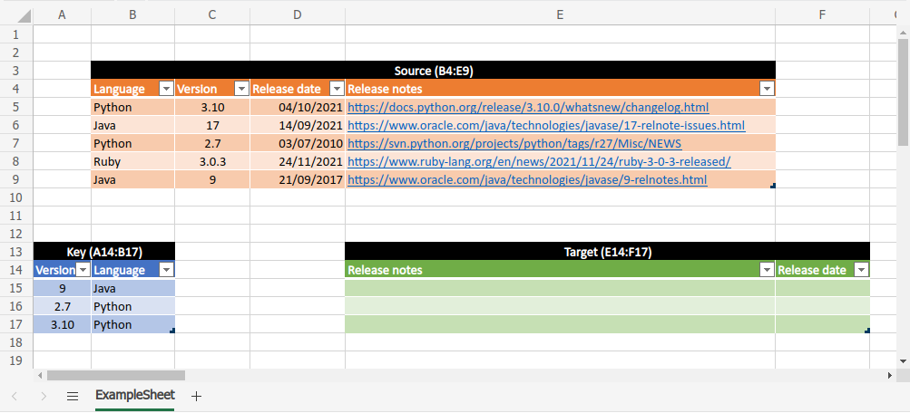
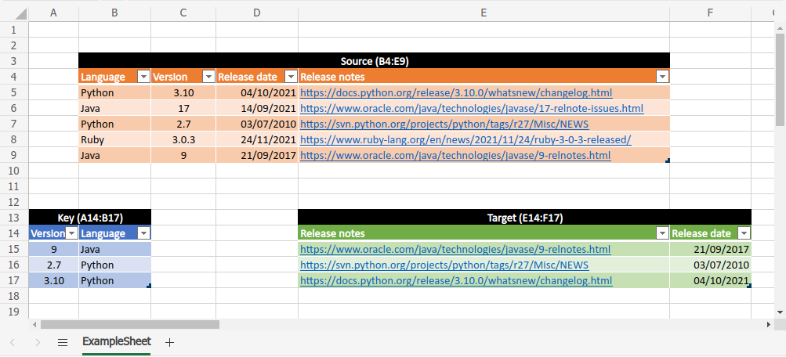

# Readd columns

This small tool reads an Excel spreadsheet (.xlsx) containing three cell
ranges, each one with column names in its first row:
- a **source** cell range;
- a **key** cell range containing a subset of the rows and columns of
  **source**;
- a **target** cell range with empty cells except for the header, which
  contains a subset of the column names of **source**.

If the columns of **key** are enough to uniquely identify the corresponding
rows in **source**, then this script fills in **target** cells with
the data obtained from **source**.

There is probably [a way to do the same thing on Excel](https://support.microsoft.com/en-gb/office/look-up-values-with-vlookup-index-or-match-68297403-7c3c-4150-9e3c-4d348188976b),
but learning it would probably have taken me longer
than writing this short Python script.

### Requirements
Python &geq; 3.8 with the following libraries:
- [openpyxl](https://foss.heptapod.net/openpyxl/openpyxl) &geq; 3.0.9 (MIT Licence)
- [tqdm](https://github.com/tqdm/tqdm) &geq; 4.62.3 (MIT licence)

To install the Python libraries, run:

```sh
python3 -m pip install -r requirements.txt
```

### Usage:
```sh
python3 readd.py input_file output_file source_range key_range target_range
```
The syntax for the ranges is `SheetName!A1:Z99`.

### Example:



```sh
python3 readd.py example/Example.xlsx example/Example_filled.xlsx 'ExampleSheet!B4:E9' 'ExampleSheet!A14:B17' 'ExampleSheet!E14:F17'
```

Output:

